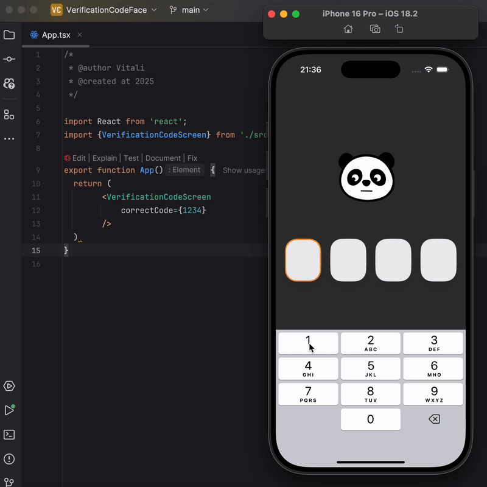

# 🐼 Wobbly Panda Head Animation

An interactive, physics-based panda head animation built with **React Native**, **Reanimated**, and **Skia**. The head reacts dynamically to movement, creating a fun and fluid effect. 🎭✨

## 🚀 Technologies Used
- **React Native** - For building the mobile application.
- **Reanimated** - For handling smooth and performant animations.
- **Skia** - For custom rendering and dynamic UI elements.

## 🎥 Demo
Check out the animation in action:


## 📦 Installation

1. Clone the repository:
   ```sh
   git clone https://github.com/v-kuper/Verification-Code-Panda.git
   cd Verification-Code-Panda
   ```

2. Install dependencies:
   ```sh
   npm install
   # or
   yarn install
   ```

3. Run the app:
   ```sh
   yarn start
   ```

## 🔧 Features
- Smooth animations with **Reanimated**.
- Custom rendering using **Skia**.
- Fun physics-based head movement.

## 📜 License
This project is licensed under the MIT License.

---
Feel free to contribute and improve the project! 🚀🐼

